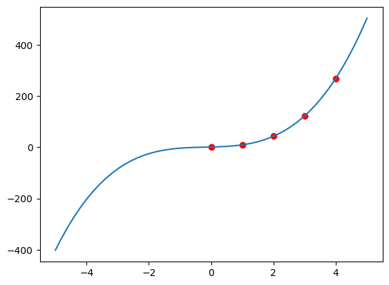

# Polynomial Interpolation

This Python notebook generate the polynomial function that passes through a given set of points, then explain the process and plot the resulting polynomial function.

## Features

- A personal method for computing polynomial coefficients.
- **Gaussian Elimination** to solve systems of linear equations.
- Calculation of factorials for polynomial terms.
- Comprehensive tabulated outputs for:
  - Input values
  - Differences (Divided Differences Table)
  - Augmented matrix and its solution
  - Polynomial coefficients
  - Final polynomial function
  - Evaluated polynomial values
- Visualization of the polynomial function and input points using **Matplotlib**.

## Getting Started

### Installing Dependencies

Run the following command to install the required dependencies:

```bash
pip install -r requirements.txt
```

### Using the Program

1. Define your input `x` and `y` values.
2. Set the range of values for the polynomial plot.
3. Run the `interpolate()` function with your inputs.

For example:

```python
Y_VALUES = [1, 9.5, 43, 122.5, 269]
X_VALUES = [0, 1, 2, 3, 4]
PLOT_RANGE = range(-5, 6)

interpolate(X_VALUES, Y_VALUES, PLOT_RANGE)
```

## Outputs

### Tabulated Outputs

The program provides detailed tabular outputs:

- **Input values**:

  ```
  ┌─────┬───────┐
  │   x │     y │
  ├─────┼───────┤
  │   0 │   1   │
  │   1 │   9.5 │
  │   2 │  43   │
  │   3 │ 122.5 │
  │   4 │ 269   │
  └─────┴───────┘
  ```

- **Differences Table**:

  ```
  ┌───────┬───────┬──────┬──────┐
  │     y │    d1 │   d2 │   d3 │
  ├───────┼───────┼──────┼──────┤
  │   1   │   8.5 │   25 │   21 │
  │   9.5 │  33.5 │   46 │   21 │
  │  43   │  79.5 │   67 │      │
  │ 122.5 │ 146.5 │      │      │
  │ 269   │       │      │      │
  └───────┴───────┴──────┴──────┘
  ```

- **Polynomial Function**:

  ```
  f(x) = 3.5x^3 + 2x^2 + 3x + 1
  ```

- **Evaluated Points**:
  ```
  ┌─────┬────────┐
  │   x │   f(x) │
  ├─────┼────────┤
  │  -5 │ -401.5 │
  │  -4 │ -203   │
  │  -3 │  -84.5 │
  │  -2 │  -25   │
  │  -1 │   -3.5 │
  │   0 │    1   │
  │   1 │    9.5 │
  │   2 │   43   │
  │   3 │  122.5 │
  │   4 │  269   │
  │   5 │  503.5 │
  └─────┴────────┘
  ```

### Graphical Outputs

The program plots the polynomial function along with the input points:


## License

This project is licensed under the MIT License.
